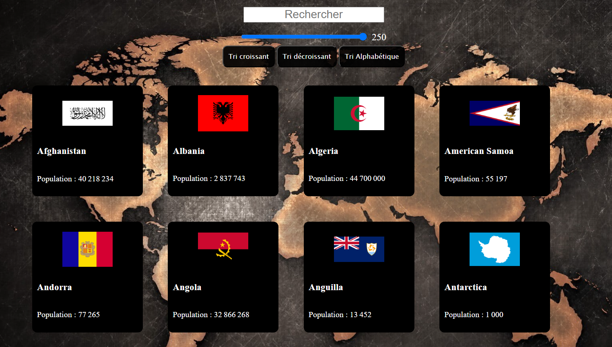

# Country App

Un exercice de From-Scratch pour s'entrainer a coder en JS. Le but etant de fetch des donnees sur une API pui de faire un map. Ajout de fonctionnalite avec des filter, des sorts et des slices

## [Decouvrir l'app Country](https://edes74500.github.io/FS_CountryApp/)

## Screenshot:

****
